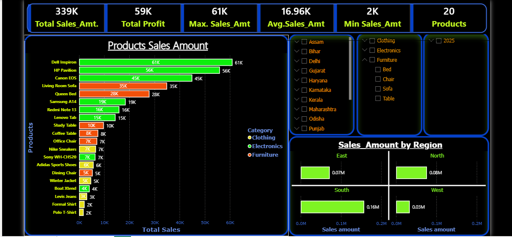

# Power BI Sales Dashboard 📊

Analyzed ₹3.39L sales data to find top products and regional gaps. Built for executive decision-making.

## 🔍 Key Insights
| Metric | Value |
| --- | --- |
| Total Sales | ₹3.39L |
| Total Profit | ₹59K |
| Top Product | Dell Inspiron - ₹61K |
| Best Region | South - ₹1.6L |
| Products Tracked | 20 |

## 🛠️ Tech Stack
- **Power BI Desktop** - Visualization & Modeling
- **DAX** - Calculated measures & KPIs 
- **Power Query** - Data cleaning

## 📸 Dashboard Preview

## 📂 Repo Contents
- `Sales_Dashboard.pbix` → Download & explore in Power BI Desktop
- `DAX.txt` → Key measures used
- `dashboard.png` → Screenshot

## 🚀 How to Use
1. Download `Sales_Dashboard.pbix`
2. Open in Power BI Desktop (Free)
3. Use slicers to filter by State/Category/Date

## 📬 Contact
LinkedIn: [Yaha apna LinkedIn URL daalo] 
Open to Power BI Analyst Fresher roles in Indore | Freelance dashboards

⭐ Star this repo if it helped you!
